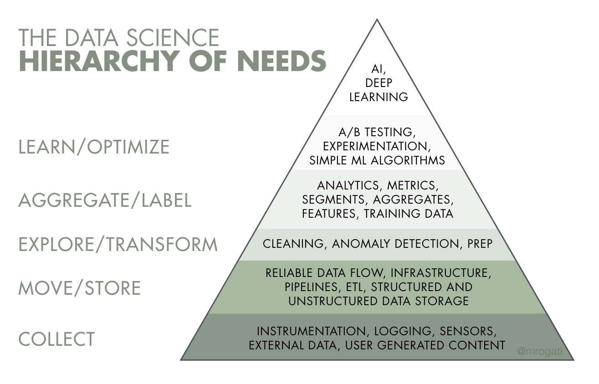

# About me
我叫鄔芳益 
目前就讀台北大學財政所碩二 
也在財務部做自動化專案實習生
# Experience
## 計劃案研究助理(RA)
### 工作內容
- 跟著系上老師完成3個專案
- 資料蒐集、資料清理、使用敘述性統計結果做圖
- 每週跟老師做code review，除說明程式碼意思外，也跟老師溝通了解工作方向
- 遇到超出自己能力範圍的問題，養成找google或詢問他人解決的習慣

### tool
#### R
- 在tidyverse下資料清理，將資料處理成適合做視覺化的資料樣態；在ggplot下畫圖
- 用list存資料
- 基本的for迴圈跟巢狀迴圈
- 字元清理的用內建函示

#### SQL
- 一點點而已，例如:select()
- 在資料中心撈資料，使用介面的是Dbeaver資料庫

## 財務部自動化專案實習生
### 工作內容
- 辦公室自動化程式開發
- 將問題處理流程步驟化，並以技術工具達成
- 專案說明手冊編寫
### tool
- GitHub:雖用過command line管理，不過現在主要還是用GitHub desktop操作
- Uipath: 視覺化操作的自動化軟體，完成自動化主要
- Excel VBA:辦公室自動化
   

# 想問問題
  
- [ ] 大家工作內容比較偏「數據分析、產品分析」還是「機器學習、演算法」 
&rarr; Analyst or Scientist  
- [ ] 技術相關的，比較是資料前期的data pipeline多還是後面模型分析多 
&rarr; Engineer or Scientist

- [ ] 如何踏上資料領域的，有實習嗎？

- [ ] 對想走資料分析的有什麼建議？

## 一般性
- [ ] 工作內容偏專案性質嗎，還是偏日常維護？大概在做什麼
- [ ] 用Data在處理哪樣的商業問題? 
- [ ] 一般花最多時間在處理的事是甚麼?

## 技術相關
- [ ] 工作上最常在用的技術工具? python、R 
- [ ] SQL跟python在工作中佔比幾比幾?(6:4)
- [ ] 認為各種工具技術能力大概多少程度能跟上團隊?
- [ ] 工作協作模式(用Notebook)?

# 最近在學習的repo

https://github.com/khanhnamle1994/cracking-the-data-science-interview#data-science-case-studies
Data science cheatsheets和Data science question bank內容蠻有趣的

https://github.com/FavioVazquez/ds-cheatsheets
cheat sheet整理，包括Python、R，還有一些處理流程的

https://github.com/vinta/awesome-python
https://github.com/TheAlgorithms/Python
一些python內容

## 基礎教學

https://github.com/microsoft/Data-Science-For-Beginners
Data science從基本介紹

https://github.com/jwasham/coding-interview-university
programming 從基礎的完整教學
